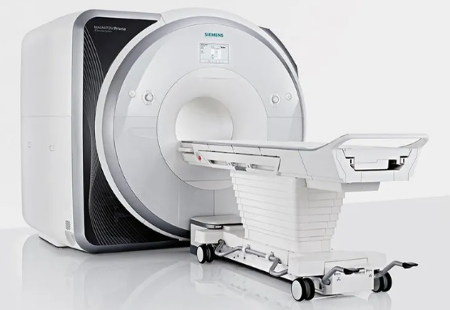

# MRI Acronyms

[](https://www.python.org/downloads/release/python-312/)
[](https://github.com/psf/black)
[](https://pycqa.github.io/isort/)
[](https://github.com/pre-commit/pre-commit)
[](https://github.com/astral-sh/ruff)
[](https://github.com/astral-sh/uv)

Magnetic Resonance Imaging (MRI) pulse-sequence/parameter vendor acronyms



***Note:*** no uniform system of nomenclature for MRI sequences has been adopted by manufacturers.

Numerous vendor-specific names are patented and therefore cannot be used by other vendors.

## Python for MRI acronyms:
* __build_lookup_table.py__ dynamically generates [LUT](./src/mri_acronyms/lut/category_to_acronym_lut.py)
* __create_report.py__ generates '.csv' [table](./data/mri_vendor_acronyms.csv) of vendor acronyms
* __search_lut_by_keyword.py__ discover relevant pulse-sequence/parameter by keyword (case-insensitive search)

### Setup Virtual Environment
[setup_project.sh](./scripts/setup_project.sh)

### Update Virtual Environment
[update_project.sh](./scripts/update_project.sh)


### Poetry Run Commands
```
# dynamically create category-to-acronym LUT
poetry run python ./src/mri_acronyms/build_lookup_table.py

# generate CSV report
poetry run python ./src/mri_acronyms/create_report.py

# search lookup table by keyword
poetry run python ./src/mri_acronyms/search_by_keyword.py
```

## Resources:

### MRI
* [Forums and Blogs](https://mriquestions.com/forumsblogslinks.html)
* [MRI for RADs](https://pubs.rsna.org/doi/epdf/10.1148/rg.262055063)
* [Radiopaedia](https://radiopaedia.org/articles/mri-pulse-sequences-1)
* [MRIquestions.com - sequences](https://mriquestions.com/hellippulse-sequences.html)

### Acronyms across vendors
* [IMAIOS](https://www.imaios.com/en/e-Courses/e-MRI/MRI-Sequences/Sequences-acronyms)
* [BIB](https://sandrofenelon.com.br/mri-acronyms-ge-siemens-philips-toshiba-canon-hitachi/)
* [MRIquestions.com](https://mriquestions.com/commercial-acronyms.html)
* [Canon acquires Toshiba](https://global.canon/en/news/2016/20161219.html)

### DICOM data
* [public datasets](https://github.com/beamandrew/medical-data)

### Credits
* [Dr. Allen Elster](https://mriquestions.com/index.html)
* [Drs. Hoa & Micheau](https://www.imaios.com/en/company/about-us)
